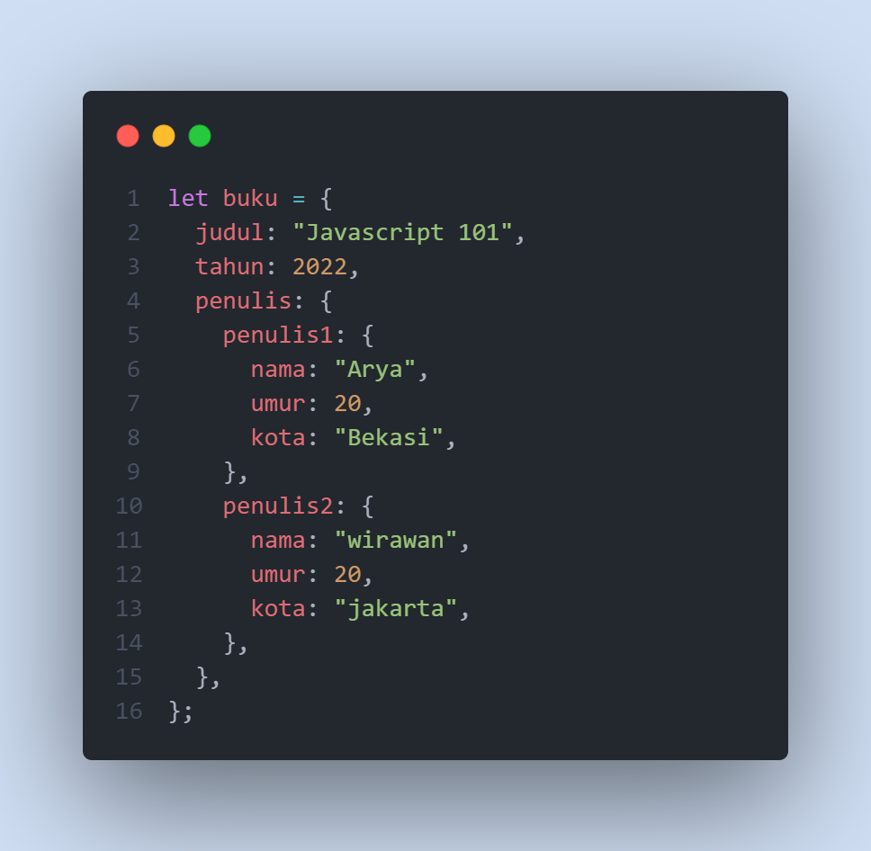

## Writing Test Week 3

### Array
- Definisi
 Array adalah tipe data yang dapat menampung berbagai tipe data apapun di dalamnya. Array memiliki 'sifat' list order yang dimulai dari index 0

- Array properties
  - .length 
    .length digunakan untuk mengetahui panjang dari suatu array

- Array Methods
  - push()
    Digunakan untuk menambahkan elemen baru ke akhir array
    
  - unshift()
    Digunakan untuk menambahkan elemen baru ke awal array
    
  - pop()
    Digunakan untuk menghapus elemen terakhir dari sebuah array
    
  - shift() 
    Digunakan untuk menghapus elemen pertama dari sebuah array 
    
  - splice()
    Digunakan untuk mengubah elemen yang ada di dalam array dengan menghapus, mengganti atau menambahkan elemen
    
    Penjelasan   
    - 2 merupakan index mulai untuk mengubah array
    - 1 merupakan berapa banyak elemen yang akan kita hapus
    
  - slice()  
    mengembalikan 'shallow copy' dari array tanpa mengubah struktur arraynya
    
- Array Looping
    - for
    
    - for of
    
    - forEach
    
    - map
    
- Array Multidimensi
Array yang berisikan Array

### Object
- Definisi
  Object adalah tipe data yang menyimpan property dan method 
- Membuat object

Penjelasan :
    - "nama" merupakan key dari object
    - "Arya" merupakan value dari key tersebut
- mengakses object
Terdapat beberapa cara dalam mengakses object
    - 1. dot notation
        
    - 2. bracket
        
- membuat key
  membuat key baru dalam sebuah object:
  
- Assign object
  Menambahkan atau merubah key object
  
- delete object
  Untuk mendelete key dari sebuah object, dapat menggunakan 'delete'
  
- method object
  Method Object adalah function yang berada di dalam object

- nested object
  Nested object merupakan object bercabang atau object yang berada di dalam object
  
- loop object
  Melakukan perulangan untuk setiap key yang ada di dalam object
  
  Key merujuk pada key yang ada di dalam object
- array of object
    Sebuah array yang menyimpan banyak object sebagai elemennya
    
### Modules
- Definisi
  Javascript Modules adalah cara untuk memisahkan code ke file yang berbeda. Sehingga file file dapat terhubung antara satu dengan yang lainnya. Tujuannya agar code yang kita buat lebih mudah untuk dikelola   
  kita dapat melakukan export pada variabel, function, class
- Export
  Digunakan untuk mengekspor codingan untuk digunakan di file lain
  
- Import
  Digunakan untuk menangkap export
  
- Export Function 
  Melakukan export sebuah function agar function tersebut dapat digunakan/diakses pada file lain
  
  Setelah itu, kita import
  
### Recursive
- Definisi 
  Recursive adalah function yang memanggil dirinya sendiri sampai suatu kondisi tertentu. Dalam menuliskannya kita dapat menambahkan type="module" pada script kita
- Base Case
  kondisi berhenti / kondisi paling kecil
- Recursion Case
  Kondisi dimana function tersebut memanggil function diri dia sendiri
- Contoh Recursive
  
  Penjelasan:
  Ketika kita memasukkan argumen 2 pada fungsi deret angka, kita cek dahulu apakah 3 == 1 ?
  
  Tentu bukan, maka dari itu masuk ke else 
  
  Setelah itu, function memanggil dirinya sendiri yang mana 3-1. maka n == 2. lalu diulang lagi proses seperti diatas. 
  
  apakah 2==1? false.   
  maka masuk ke else lagi
  
  Maka masuk ke function diri dia sendiri lagi, yang mana n-1 => 2-1 == 1 
  setelah itu, dicek lagi
  
  apakah n == 1? true.
  maka console.log(n) 
  maka tampil 1       
  Proses tersebut diulang ulang sampai function selesai.
### Asynchronous
- Ketika kita menuliskan baris code, baris code tersebut dibaca dari atas ke bawah. Ketika proses dari suatu baris code belum selesai, maka terjadi antrian.
  
- Javascript memiliki fitur Single Thread, Non-Blocking, dan Asynchronous
    - Single thread
        Hanya memiliki 1 jalur proses. yang mana saling tunggu menunggu sampai suatu proses selesai baru dapat menjalankan proses lain
    - Non-Blocking
        Mempersilahkan proses lain untuk dikerjakan apabila suatu proses membutuhkan waktu dalam mengerjakannya
    - Asynchronous
        Proses dapat didahului dan tidak harus dilakukan secara berurutan
- Callback
  Callback adalah function yang dijadikan argumen
- setTimeout()
  
- Promise
  Promise simpelnya kita artikan sebagai janji. Promise mewakili penyelesaian atau kegagalan dari operasi asynchronus. Promise memiliki beberapa istilah:
    - Pending
        Kondisi awal dimana proses promise berjalan
    - Rejected
        Kondisi dimana promise gagal/ditolak
    - Fulfilled
        Kondisi dimana promise terpenuhi
  Cara membuat promise
  
  Cara menangkap promise
  
### Web Storage
- Definisi
  Web Storage adalah storage yang dimiliki oleh web browser yang dapat menyimpan data di browser user
- Local Storage
  Menyimpan data tanpa expired date
- Session Storagae
  Menyimpan data dalam satu sesi (ketika browser tab ditutup, maka datanya hilang)
- Menyimpan ke local storage
  
- Mengakses ke local storage
  